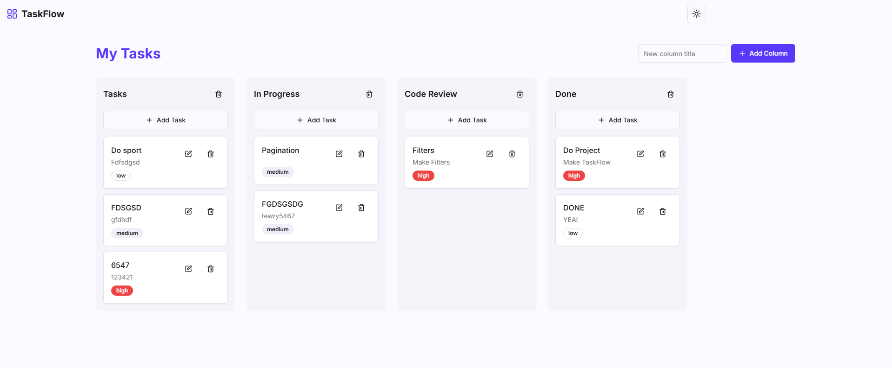

# TaskFlow - Task Tracking Board

TaskFlow is a simple yet powerful task tracking application that allows users to create and manage tasks across multiple columns using a drag-and-drop interface. The app supports features such as task prioritization, task editing, and dynamic column creation.

## Features
- **Drag and Drop:** Tasks can be moved between columns by dragging and dropping them.
- **Create New Columns:** Easily add new columns to organize tasks.
- **Task Management:** Add, edit, and delete tasks in any column.
- **Priority Management:** Assign a priority level to each task (Low, Medium, High).
- **Responsive Design:** Fully responsive layout for desktop, tablet, and mobile screens.
- **Dark/Light Theme Support:** Switch between dark and light themes for improved user experience.
- **Persistent Storage:** Tasks and columns are saved in local storage, so they persist between page reloads.

## Technologies Used
- **React:** For building the user interface.
- **React Drag and Drop:** For implementing drag-and-drop functionality.
- **Lucide Icons:** For icons like add, edit, and delete buttons.
- **Tailwind CSS:** For styling the components.
- **Next.js:** For server-side rendering and optimized performance.
- **LocalStorage:** For persisting tasks and columns.

## Screenshot
Here is a screenshot of the application:



## Installation

To get started with TaskFlow, follow the steps below:

1. **Clone the repository:**
   ```bash
   git clone https://github.com/your-username/taskflow.git

2. **Navigate to the project folder:**
   ```bash
   cd taskflow

3. **Install dependencies:**
   ```bash
   npm install

4. **Start the development server:**
   ```bash
   npm run dev

5. **Open http://localhost:3000 in your browser.**
